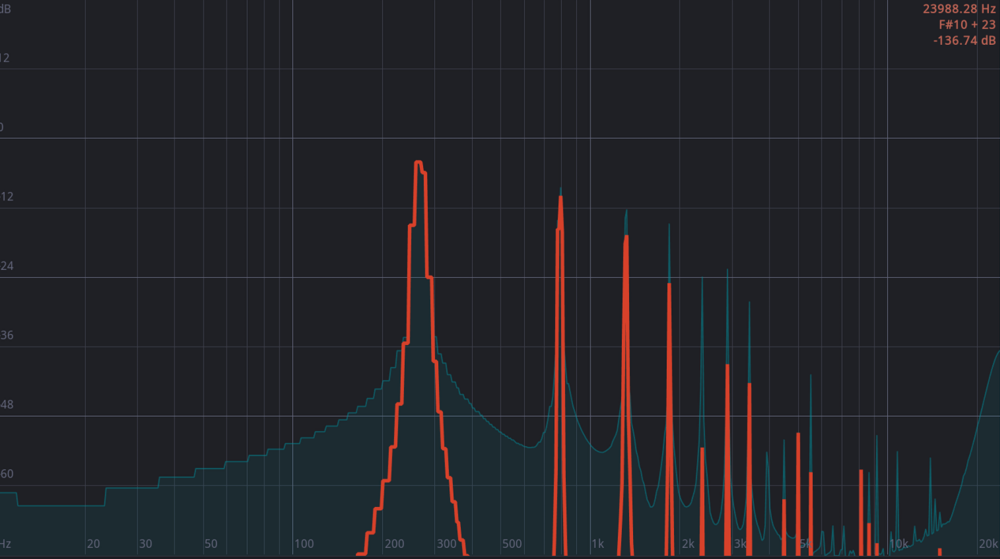

# DistAll

General purpose CLAP and VST3 distortion

## Current status and roadmap

`Distall` is based on [nih-plug](https://github.com/robbert-vdh/nih-plug/tree/master) and currently only implements a **Soft clipping** and a **Hard clipping** distortion. Future developments include:

* DRY / WET signal separation
* asymmetric non linear functions explorations
* non linearity with memory
* aliasing suppression by oversampling:
  * Lanczos based oversampling
* UI: solve the following dilemma: keep using this [vizia fork](https://github.com/robbert-vdh/vizia) (well integrated in **nih-plug** but more and more divergent from Vizia development and documentation) or go wild?


## Building

After installing [Rust](https://rustup.rs/), you can compile DistAll as follows:

```shell
cargo xtask bundle distall --release
```

## Install precompiled plugings

Select the .tar archive of the version you want to install [in the release section](https://github.com/zar3bski/distall/releases) for your Operating System and your architecture. You can find the following compiled plugins

|      |Windows|macOS|Linux |
| ----:|:-----:|:---:|:----:|
|amd64 |  X    |  X  |  X   |
|arm64 |       |  X  |  X   |

## Features

### Oversampling

To reduce the aliasing produced by the distortion, the following oversampling methods may be applied. All the spectral graphs displayed bellow are produced from a sin signal of 523,251 Hz (C4) using the **soft_clipping** distortion.

#### None

This is the raw sound. Use it mainly to produce aggressive old-school/industrial sounds 


#### NaiveOversampler

x2 oversampling using a serie of Biquad based **low pass filters** before and after the distortion function.

